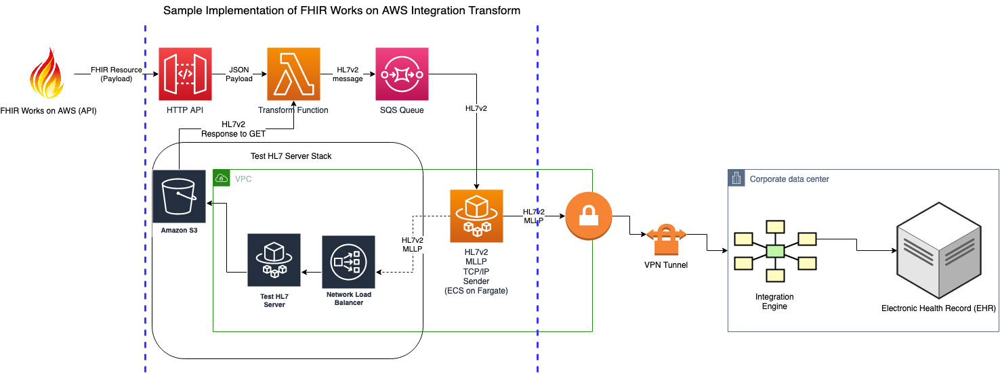

# fhir-works-on-aws-hl7v2-transform

This AWS sample project demonstrates implementation of an Integration Transform designed to extend third-party integration capabilities of [FHIR Works on AWS framework](https://aws.amazon.com/blogs/opensource/using-open-source-fhir-apis-with-fhir-works-on-aws/).

## Architecture

This sample architecture consists of multiple AWS serverless services. The endpoint is hosted using API Gateway backed by a Lambda function. We chose to use SQS to pass messages from transform function to Fargate container implementing HL7v2 client (sender).

We also implemented Test HL7 Server using NLB, Fargate, and S3.

In production environment, you would need to establish secure encrypted connection from your VPC to the network where your HL7 endpoint is hosted. For illustration purposes, we show encrypted connection from your VPC to your corporate data center using VPN tunnel. You should consult your account team for prescriptive guidance regarding establishing secure and reliable network connection between your on-premises network and VPC.



## Implementation Notes

### FHIR POST and PUT Interactions

FHIR resource write interactions (POST and PUT) produce HL7v2 messages that then will be forwarded to the third-party system via its HL7v2 interface endpoint. In our sample, we send HL7v2 messages via TCP/IP socket connection to a Test HL7 Server which stores them on S3.

### FHIR GET Interaction

Implementation of this interaction depends on third-party system integration capabilities. In our case, we implemented it by taking advantage of the Test HL7 Server that we deploy in the account. This test server stores HL7v2 messages as objects in S3 bucket. Other possible implementation may require direct interaction with operational data store (using JDBC or ODBC connections), HTTP API, or HL7v2 query messages.

## Deployment

### Pre-requisites

- [AWS Cloud Development Kit (CDK)](https://aws.amazon.com/cdk/). Please install CDK on your workstation using [instructions in AWS documentation](https://docs.aws.amazon.com/cdk/latest/guide/getting_started.html)
- [AWS Command Line Interface (CLI)](https://aws.amazon.com/cli/)
- [AWS configuration and credentials](https://docs.aws.amazon.com/cli/latest/userguide/cli-configure-files.html). We suggest that you create a named profile (referred to as`<AWS PROFILE>` in command line examples below) for your IAM user that you can use to pass to `cdk` and `aws` command line utilities.

#### Bootstrap CDK (Optional)

```
cdk [--profile <AWS PROFILE>] bootstrap aws://{aws_account_id}/{region}
```

where `{aws_account_id}` represents your AWS Account ID.

### (Optional) VPC Stack

You can use an existing VPC to deploy Integration Transform and (optional) Test HL7 Server stacks. You can also create new VPC using `ecs-vpc` CDK stack included with this sample. You can also specify optional context variable `cidr` to control IP address space configuration.

```
cd ${REPOSITORY_ROOT}/ecs-vpc
python3 -m venv .env
source .env/bin/activate
pip3 install -r requirements.txt
cdk [--profile <AWS PROFILE>] deploy --context cidr="10.10.0.0/16"
```

Please note VPC ID that will be displayed after VPC stack is deployed:

```
ecs-vpc.TransformVpc = vpc-example-id
```

### (Optional) HL7 Server Stack

```

cd ${REPOSITORY_ROOT}/test-hl7-server/cdk-infra
python3 -m venv .env
source .env/bin/activate
pip3 install -r requirements.txt
cdk [--profile <AWS PROFILE>] deploy --context vpc-id="vpc-example-id" --context server-port=2575

```

Copy and save the following outputs that you will need to pass as inputs to the Integration Transform stack

```
test-hl7-server-stack.Hl7TestServerServiceLoadBalancerDNSHEX_ID = <random_id>.elb.<region>.amazonaws.com
test-hl7-server-stack.TestHl7ServerFQDN = <random_id>.elb.<region>.amazonaws.com
test-hl7-server-stack.TestHl7ServerS3 = test-hl7-server-stack-hl7testserveroutputbucket<random_id>
```

### Transform Stack

Before deploying Integration Transform stack, you will need to obtain FHIR Works on AWS resource router lambda execution role (`FHIR_SERVICE_LAMBDA_ROLE_ARN: FhirServiceLambdaRoleArn`), which is one of outputs of the FHIR Works on AWS deployment stack. Please refer to [this section of the documentation](https://github.com/awslabs/fhir-works-on-aws-deployment/blob/api/INSTALL.md#aws-service-deployment) describing FHIR Works on AWS deployment. You can use `serverless info --verbose --aws-profile <AWS PROFILE> --stage <STAGE> --region <AWS_REGION>` to produce stack output post deployment.

You will pass lambda execution role to the Integration Transform deployment process as CDK context variable `resource-router-lambda-role`.

Other context variables:

`vpc-id` : ID of VPC where you would like to launch ECS Fargate cluster component of this architecture

`hl7-server-name`: FQDN (or IP address) of the HL7v2 endpoint that will be listening for connection from HL7v2 sender component. If you deployed HL7 test server, you can use value of output parameter `test-hl7-server-stack.TestHl7ServerFQDN`

`hl7-port`: TCP port that HL7v2 server will be listening on

`test-server-output-bucket-name`: if you deploy optional Test HL7 Server stack, you can find this parameter in the stack outputs (`test-hl7-server-stack.TestHl7ServerS3`)

```
cd ${REPOSITORY_ROOT}/fhir-hl7-transform/cdk-infra
python3 -m venv .env
source .env/bin/activate
pip3 install -r requirements.txt
cdk [--profile <AWS PROFILE>] deploy --context vpc-id="vpc-example-id" --context resource-router-lambda-role="lambda-execution-role-arn" --context hl7-server-name="hl7server.example.com" --context hl7-port="2575" --context test-server-output-bucket-name="<bucket_name>"
```

#### Outputs

CDK deployment will generate several outputs, you will need to take note of two of them:

```
fhir-to-hl7v2-transform.TransformApiRegion = us-west-2
fhir-to-hl7v2-transform.TransformApiRootUrl = https://<api-id>.execute-api.us-west-2.amazonaws.com/prod/
```

These values will be used to create AWS System Manager parameters on FHIR Works on AWS. FHIR Works on AWS will make API requests to the URL and region specified in these parameters. This allows FHIR Works on AWS to integrate with this Integration Transform.
FHIR Works on AWS Integration Transform parameters are: `/fhir-service/integration-transform/<STAGE>/url` and `/fhir-service/integration-transform/<STAGE>/awsRegion`, where STAGE is the stage name that you used when deploying FHIR Works on AWS. For more information please refer to this [link](https://github.com/awslabs/fhir-works-on-aws-deployment/blob/api/INSTALL.md#store-integration-transform-info-in-aws-system-manager-parameter-store).

These outputs can also be viewed in AWS Console by navigating to CloudFormation service page in the region where the stack was deployed, selecting appropriate stack, and clicking on Outputs tab.

## Testing

You can follow testing steps outlined in [FHIR Works on AWS documentation](https://github.com/awslabs/fhir-works-on-aws-deployment/blob/api/README.md#usage-instructions). This Integration Transform support CREATE, READ, and UPDATE (not DELETE) interactions on Patient resource. An example Patient resource can be found [here](resources/patient.json).

## Security

See [CONTRIBUTING](CONTRIBUTING.md#security-issue-notifications) for more information.

## License

This library is licensed under the MIT-0 License. See the LICENSE file.
